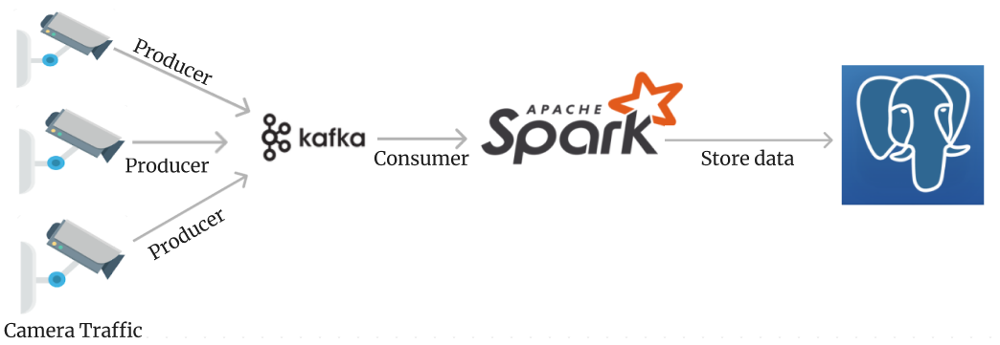

# Detected-motorcyclist-not-wearing-a-helmet.
In this article I want to detect motorcyclists who do not wear helmets with real time. Build a real-time system for traffic. I use Yolov8 for detect and Spark combine Kafka to take a data real time from camera trafic.

### Step 1: I trained yolov8 with my dataset in google colab, then i take a model and use that for detection helmet and no-helmet.
I use ultralytics for collect and detect box in web, then i train with model yolov8. In folder train have result and evaluate.

### Step 2: Transmit data using kafka.
#### First: start your sever kafka in your local.
In my file "producer.py", i have provided a data transfer mechanism using kafka.
#### Second: 
